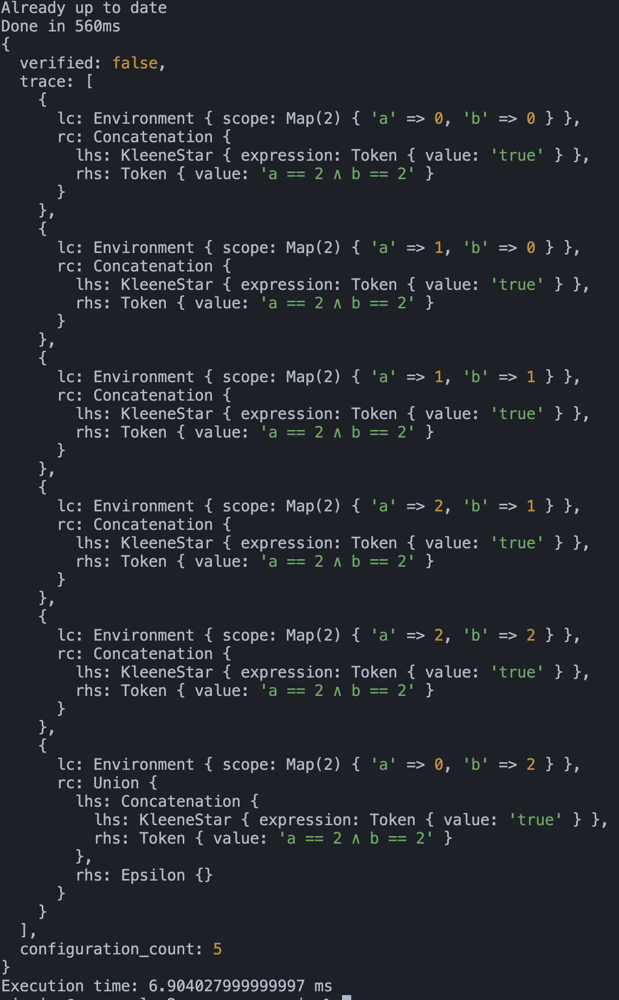

# A RegularExpression model-checker for Soup with z2mc

This project builds a model-checking with 3 ingredients:

1. The Soup Language
2. The Derivative-based regular expression semantics
3. The z2mc model-checking framework

try `run.sh`

